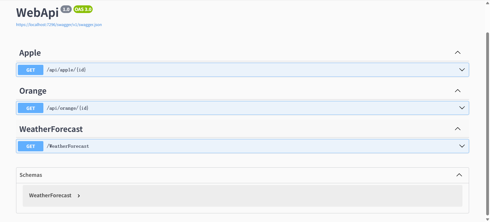

## Simple.DynamicWebApi

### 简介
 `Simple.DynamicWebApi` 是一个轻量级 .NET 组件库，受 ABP 框架的动态 Web API 设计的启发，通过约定驱动的方式，自动将符合条件的类动态映射为 RESTful Web API，无需手动编写控制器。该库可以减少样板代码并简化服务暴露流程，适用于模块化架构或需要快速暴露服务接口的场景。

### 1、快速开始

#### 第一步：安装 NuGet 包
```powershell
 Install-Package Simple.DynamicWebApi
```

#### 第二步： 注册 DynamicWebApi 服务
```csharp
builder.Services.AddDynamicWebApi(); 
```

#### 第三步：集成 Swagger（推荐）
```csharp
// 添加 Swagger 服务
builder.Services.AddSwaggerGen(o =>
{
    // 控制哪些 API 操作应包含在 Swagger 文档中
    // 不返回 true 会导致Swagger文档中不显示动态API路由接口
    o.DocInclusionPredicate((docName, description) => true);

    //添加 XML 注释文档
    var basePath = System.AppDomain.CurrentDomain.BaseDirectory;
    foreach (var xmlFile in Directory.GetFiles(basePath, "*.xml"))
    {
        o.IncludeXmlComments(xmlFile, true);
    }
});

// 添加 Swagger 中间件
if (app.Environment.IsDevelopment())
{
    app.UseSwagger();
    app.UseSwaggerUI();
}
```

### 第四步： 定义服务类（两种方式）

#### 方式一：实现 `IDynamicWebApi` 接口
```csharp
using Simple.DynamicWebApi;

public class AppleService : IDynamicWebApi
{
    [HttpGet("{id:int}")]
    public int GetApple(int id)    
    {
        return id;
    };
}
```

#### 方式二：标记 `[DynamicApi]` 特性
```csharp
using Simple.DynamicWebApi;

[DynamicApi]
public class OrangeService
{
    [HttpGet("{id:int}")]
    public int GetOrange(int id) => id;
}
```

**访问地址**：  

- /api/apple/{id}

- /api/orange/{id}

> 默认路由格式为 `/api/{service-name}/{action}`，可通过配置修改 




### 2、约定与配置

#### 2.1 核心约定
  - **服务类标识**：需实现 `IDynamicWebApi` 接口 或 标记 `[DynamicApi]` 特性  
  - **默认模板**：`/api/{service-name}/{action}`  
  - 方法名自动转换为短横线命名法（如 `GetUserInfo` → `GET /api/user/user-info`）  
  - **HTTP 方法映射**：  
  - 优先级顺序：`[HttpXxx]` 特性 > 方法名前缀匹配 > 默认 HTTP 方法（默认 `POST`）  
  - 通过 `AddDynamicWebApi`  可以可自定义动态API行为：

### 2.2 全局配置项
通过 `AddDynamicWebApi(options => { ... })` 自定义行为：  
示例：自定义路由前缀与根路径
```csharp
builder.Services.AddDynamicWebApi(options => 
{
    options.DefaultRoutePrefix = "services";  // 路由变为 /services/...
    options.AddRootPathToRoute = true;        // 启用根路径
    options.DefaultRootPath = "v1";           // 路由变为 /services/v1/...
});
```

| **配置项**               | **类型** | **默认值** | **说明**                                                                 |
|--------------------------|----------|------------|-------------------------------------------------------------------------|
| `EnableDynamicWebApi`    | `bool`   | `true`     | 是否启用动态WebAPI功能（全局开关）                                       |
| `DefaultHttpMethod`      | `string` | `"POST"`   | 未标注HTTP特性且无前缀匹配的方法使用的HTTP动词                           |
| `DefaultRoutePrefix`     | `string` | `"api"`    | 全局路由前缀（如 `api`）                                                |
| `DefaultRootPath`        | `string` | `"app"`    | 根路径名称（需配合 `AddRootPathToRoute` 使用）                          |
| `AddRoutePrefixToRoute`  | `bool`   | `true`     | 是否将 `DefaultRoutePrefix` 加入路由（`true` 时路由为 `api/xxx`）       |
| `AddRootPathToRoute`     | `bool`   | `false`    | 是否将 `DefaultRootPath` 加入路由（`true` 时路由为 `api/app/xxx`）      |
| `RemoveActionPrefix`     | `bool`   | `true`     | 是否移除方法名前缀（如 `GetUser` → `User`）                             |
| `RemoveControllerSuffix` | `bool`   | `true`     | 是否移除控制器后缀（如 `UserService` → `User`）                         |
| `ControllerPostfixes`    | `string[]` | 多种后缀   | 要移除的控制器后缀列表（当 `RemoveControllerSuffix=true` 时生效）       |
| `ConventionalPrefixes`   | `Dictionary<string, string[]>` | 预置映射   | 方法名前缀与HTTP动词的映射关系（用于无特性标注的方法）|                  |

---

### 3、HTTP动作映射规则

#### 3.1 默认前缀映射表
| HTTP方法 | 方法名前缀（默认）                             | 示例方法名         | 生成的路由动作 |
|----------|-----------------------------------------------|--------------------|----------------|
| `GET`    | Get, Query, Find, Fetch, Select               | `GetUser()`        | GET /user      |
| `POST`   | Post, Create, Add, Insert, Submit, Save       | `CreateOrder()`    | POST /order    |
| `PATCH`  | Patch                                          | `PatchDetails()`   | PATCH /details |
| `PUT`    | Put, Update, Modify                           | `UpdateProfile()`  | PUT /profile   |
| `DELETE` | Delete, Remove, Clear, Cancel                 | `RemoveItem()`     | DELETE /item   |

#### 优先级规则
1. **特性优先**：方法上的 `[HttpGet]`、`[HttpPost]` 等特性优先级最高
   ```csharp
   [HttpPut] // 强制为PUT方法
   public void Update() => ... 
   ```
   
2. **前缀匹配**：无特性时按方法名前缀匹配
   ```csharp
   public void FetchData() => ... // 自动识别为GET方法
   ```

3. **默认方法**：无特性且无匹配前缀时使用 `DefaultHttpMethod` 配置
   ```csharp
   public void Process() => ... // 默认变为POST方法
   ```

#### 3.2自定义前缀映射示例（一般默认的就能满足场景需求）
通过配置 `ConventionalPrefixes` 可完全自定义映射规则：
```csharp
builder.Services.AddDynamicWebApi(o => 
{
    o.ConventionalPrefixes = new Dictionary<string, string[]>
    {
        // 自定义 GET 动词前缀
        ["GET"] = new[] { "Query", "Retrieve", "Load" },
        
        // 自定义 POST 动词前缀
        ["POST"] = new[] { "Create", "Generate" },
        
        // 自定义 HTTP 动词前缀
        ["HEAD"] = new[] { "Check", "Verify" }
    };
});
```

##### 示例

   ```csharp
   public void LoadAvailability() => ... // -> GET /api/user/availability
   ```

### 4、 命名规范化策略  
#### (1) 默认行为（短横线命名法）  
```csharp
public class UserService
{
    public void GetUserInfo() => ...  // → GET /api/user/user-info
    public void CreateAuthToken() => ... // → POST /api/user/auth-token
}
```


#### (2) action前缀保留配置  
通过 `RemoveActionPrefix` 控制是否保留HTTP方法前缀：  
```csharp
builder.Services.AddDynamicWebApi(o => 
{
    o.RemoveActionPrefix = false; // 保留前缀
});
```
结果：  
```csharp
public void GetUserInfo() => ...  // → GET /api/user/get-user-info
public void CreateAuthToken() => ...  // → GET /api/user/creat-auth-token
```
#### (3) Controller后缀自动移除规则
当 `RemoveControllerSuffix = true` 时，默认移除以下后缀：  
```csharp
"ApplicationService", "AppService", "AppServices", "Service", "Services", "ApiController", "Controller"
```
例如：  
- `StudentAppService` → `student` （移除 `AppService`）  
- `OrderController` → `order` （移除 `Controller`）  


